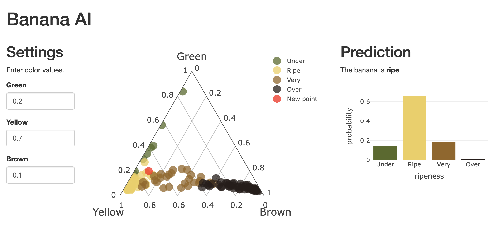

# Bananas Shiny App 

Shiny app for classifying ripening bananas based on their color.

Data set from <https://github.com/psolymos/bananas>.

| Flavour           | Link  | Image  |
|-------------------|---|---|
| Python Shiny      | [`py-shiny`](./py-shiny/)  | [`ghcr.io/h10y/bananas/py-shiny`](https://github.com/h10y/bananas/pkgs/container/bananas%2Fpy-shiny)  |
| R Shiny           | [`r-shiny`](./r-shiny/)  | [`ghcr.io/h10y/bananas/r-shiny`](https://github.com/h10y/bananas/pkgs/container/bananas%2Fr-shiny)  |

Shinylive does not work - see the [`shinylive.md`](./shinylive.md) file for details.
